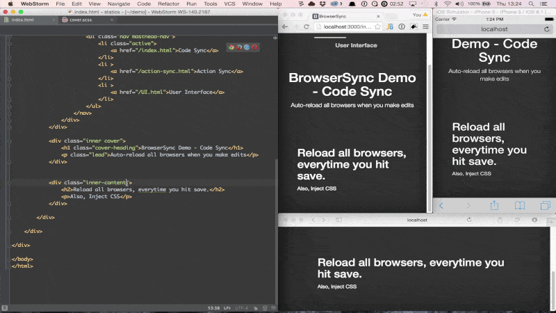

# Gulp Starter Kit
A starter kit for fast starting your new front-end builds and automatic building.

- Compiles, autoprefixes and minimizes your Scss (can easily switch to Sass or LESS)
- Uglifys your JS
- Compresses your Images
- Generates a BrowserSync URL for you to access.

### Getting Started
Clone: `http://github.com/markxxv/gulp.git`

Once you have cloned the repo, navigate in to the directory via terminal and run.

```bash
npm install
gulp
```

## Addons

- Bootstrap 4 only grid wit Sass
- Changed Bootstap gap
- Fonts smoothing by default



